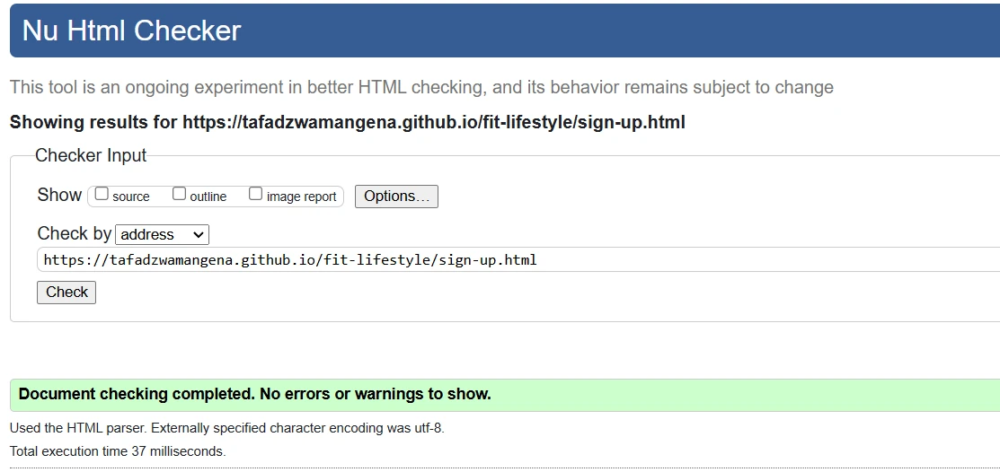

---

# Fit Lifestyle

Discover your ultimate fitness journey with Fit Lifestyle, the perfect online guide for beginners eager to embrace a healthier lifestyle. Explore our 7-day workout routines and budget-friendly meal prep plans, designed to make healthy living accessible and enjoyable.

Our easy sign-up process ensures you can start your transformation effortlessly, with expert tips and personalized support every step of the way. Join Fit Lifestyle today and take the first step towards a fitter, healthier you!

The site can be accessed using this link, [Fit Lifestyle](https://tafadzwamangena.github.io/fit-lifestyle/index.html)

---

## User Experience (UX)

## User stories

 - ### First Time Visitor Goals

    - As a first time user, I want to quickly understand what the website is about and what value it offers. The main message or purpose should be clear and concise.
    - As a first time user, I am looking for intuitive navigation with well-organized menus and clear labels to help me find what I am looking for without frustration.
    - As a first time user, I am interested in a clean, professional, and aesthetically pleasing design that makes a good first impression and encourages me to stay longer.

 - ### Returning Visitor Goals:

    - As a returning user, I am looking for a consistant experience. I expect the same navigation, layout and design I am used to which helps me find what I am looking for quickly
    - As a returning user, I am interested in updated content. Fresh, relevant, and updated content keeps users coming back. This could include new articles, products, blog posts, news updates, or user-generated content.
    - As a returning user, I am in search of enhanced features and functionalities. Returning users often look for new features, improvements, or functionalities that enhance their experience, such as advanced search options, better filtering, or new tools.

- ### Frequent Visitor Goals:

    - As a frequent user, I am looking for a reliable and good performing site. Consistent performance, minimal downtime, and quick load times are crucial for keeping returning users satisfied.
    - As a frequent user, I expect personilized content. Personalized recommendations, and content based on past behavior and preferences enhance user satisfaction and engagement.
    - As a frequent user, I want options to contact the company directly from the site and not via social media.

- ### External User's Goal;

  - Site users are new to fitness and are interested in wokout routines and meal preps.

- ### Site Owner's Goal;

  - The goal of the site is to provide a reliable source of information and encourage beginners to exercise and eat healthy.

---

## Features

- ### Logo and Navigation Bar

  - The logo and navigation bar are displayed in all pages that is Home page, Workout Routines page, Meal prep page as well as the Sign up page. The are fixed in one position on all the pages so the user can easily navigate throughout the website.
  - The Fit Lifestyle logo and name are linked to the home page, clicking on either in any of the pages will re-direct the user to the home page.
  - The navigation bar is fully responsive.

  

- ### Hero Section

  - The hero section is an eye captivating area to catch the eye of the user upon loading the website.
  - This section is loaded with an image of a man exercising in his workout gear and a captivating text "Having a healthy life is having a good life" meant to encourage the user.

  

- ### Motivation Section

  - The section is meant to give the user motivation to start a healthy and a Fit Lifestyle by giving physical and mental benefits for working out as well as physical and mental benefits of having healthy meals.

  

- ### The footer

  - The footer section is placed at the bottom of each page with encouraging words from Fred Devito as well as links to various Fit Lifestyle social media links.
  - This is important to the user as it challenges them to archive their goals and to connect with Fit Lifestyle on social media to learn more.

  

- ### The Home Page

  

- ### The Workout Routine Page

  - The workout routine page aims to give the user an effective weekly workout routine incoperating cardio, fitness and rest days routine.
  - The workout schedule is drawn by Jacklyn Romano, CPT, a certifies physical therapist.

  

- ### The Meal Prep Page

  - This page is meant to give the user a balanced diet of a 7 day meal plan that is affordable and help the user reach their fitness goals.
  - The 8 healthy and effective diets is broken down into 7 days of the week and comprises of breakfast, lunch, evening meal and snacks.

  

- ### The Sign Up Page

  - This page is meant to help the user to sign up and start their Fit Lifestyle journey. The sign up form collects information life the age of the user as well as their goals.
  - In addition, the user's names and contact information will also be collected before submitting the form. Also the form comprises of terms and conditions at the ends.

  

---

- ## Features Left to Implement
  - In the future, I intend to add a "contact us" section where users can interact with us to ask questions and give testimonials.
  - The idea is to make the user encouraged to workout and get committed. I intend to add more pictures and videos to the website to guide the user to properly workout and eat.
  - Also I intend to link a page of recipies.

---

## Design

### Color Scheme

- Blue violet is used as the main color of the website as it is a rich and vibrant hue that combines the coolness of blue with the depth and intensity of violet.
- Rebecca purple, Wisteria and Thristle are used to design the Meal Prep table to differentiate between the different days and meals yet giving a touch of elegance, sophistication and vibrancy.
- White is the main color used on Blue Violet, this includes text, logos and icons. The reason is because, this maintains the elegancy of the page while making the text and logos clearly visible.

  

### Font

- Montserrat Google font is used in this website in order to increase visibility on the content in the website.

  

---

## Technologies Used

### Languages Used

- [HTML](https://en.wikipedia.org/wiki/HTML) : HTML was used as the skeleton and foundation of this website.
- [CSS](https://en.wikipedia.org/wiki/CSS) : CSS was used to style and layout the website.

### Frameworks, Libaries & Programs Used

1.  [Google Fonts](https://fonts.google.com/) : Montserrat Google font was used to give clear visibility of the text.
2.  [Font Awesome](https://fontawesome.com/) : Font awesome Icons were used on the meal prep page to improve visual hierarchy.
3.  [Git](https://en.wikipedia.org/wiki/Git) : Git was used for the website version control.
4.  [Github](https://en.wikipedia.org/wiki/GitHub) : GitHub is the website host.
5.  [Balsamiq-Wireframes](https://balsamiq.com/wireframes/) : Balsamiq wireframes was used to create the wireframes of the website.
6.  [Pexels.com](https://www.pexels.com/) : All images used in the website were downloaded from [pexels.com](https://www.pexels.com/).
7.  [GIMP](https://www.gimp.org/) : GIMP was used to make images to .webp format.
8.  [looka.com](https://looka.com/) : looka.com was used to design and brand the Fit Lifestyle logo
9.  [CSS-Flexbox](https://en.wikipedia.org/wiki/CSS_Flexible_Box_Layout) : was used to arrange items simmetrically on the pages.
10. [Gitpod](https://www.gitpod.io/) : was used as the main tool to write and edit code.

---

## Testing

### Compatibility

- I tested this website in Chrome, Microsoft Edge, Opera and Firefox to make sure avery page works and is responsive.

  - #### Chrome
  https://github.com/TafadzwaMangena/fit-lifestyle/assets/141625148/a45e5b77-dafc-49b2-b043-8b49c614d180

  - #### Microsoft Edge
  https://github.com/TafadzwaMangena/fit-lifestyle/assets/141625148/7186baa6-841f-40bf-935c-9851033035ed

  - #### Opera
  https://github.com/TafadzwaMangena/fit-lifestyle/assets/141625148/4ee7af8e-58e1-428b-a41e-e4989c6c0e2e

  - #### Firefox
  https://github.com/TafadzwaMangena/fit-lifestyle/assets/141625148/20438b4e-72af-44fd-8542-553e5b897d26

### Manual Testing

- I confirmed all internal links work and all external links work being opened on a new tab.
- I tested that the form works, all information is required in every input in it's format, e.g email should be similar to john@doe.com and phone number requires digits. The send and clear buttons work and once the send button is pressed, a responsive thank you page pops up.

### Responsiveness

- I viewed the website in different screen sizes, small mobiles, large mobiles, tablets and laptops (using devtools) to ensure the text and images, colors etc are all clearly visible in different screen sizes.
- Please check the compatibily videos above to see how the website responds on different screens.

---

## Validator Testing

I used Markup Validator and W3C CSS Validator Sevices to validate every page of the project, no errors were found.

### HTML

- W3C Makup Validator - [Results](https://validator.w3.org/nu/?doc=https%3A%2F%2Ftafadzwamangena.github.io%2Ffit-lifestyle%2Findex.html)

  - #### Home Page
  

  - #### Workout Routines Page
  

  - #### Meal Prep Page
  

  - #### Sign-Up Page
  

  - #### Response Page
  

### CSS

- W3C CSS Validator - [Results](https://validator.w3.org/nu/?doc=https%3A%2F%2Ftafadzwamangena.github.io%2Ffit-lifestyle%2Findex.html)
- Direct input results
  

### Lighthouse Report

- Accessibility - I confirmed that the colors and fonts chosen are easy to read and accessible (in all pages) by running it through lighthouse in devtools.
- Due to images and videos, the performance was lower however for visual representation I decided to keep the displayed images and videos.
- See below the results of each page.

  - Home Page

  - Workout Routine Page

  - Meal Prep Page

  - Sign Up Page

  - Responsive Page

---

## Bugs

  ### Solved Bugs
    
  1. The navigation bar, logo and social media networks in footer would shake, move and be distorted when I hover on them

  _Solution_: I removed border on nav and footer divs when hovered

  2. The hero image was was not centered on different screen sizes and kept moving.

  _Solution_: I used background-position to place the hero image in the center of the screen with the best visibility.

  ### Unsolved Bugs

1. None.  All discovered bugs were fixed. 

In case any bugs are discovered please contact us on any of the social media platforms on the footer.

---

## Deployment

### GitHub Pages Deplyment

- The site was deployed to GitHub pages. The steps to deploy are as follows:
  - In the GitHub repository, navigate to the Settings tab,
  - From the source section drop-down menu, select the Master Branch,
  - Once the master branch has been selected, the page will be automatically refreshed with a detailed ribbon display to indicate the successful deployment.

The live link can be found [here](https://tafadzwamangena.github.io/fit-lifestyle/)

---

## Credits

### Code

- This project was ceated using a full template provided by [Code Institute](https://github.com/Code-Institute-Org/ci-full-template).
- The README.md file was inspired by Code Institute with some changes.
- [MDN Web Docs](https://developer.mozilla.org/en-US/), was used to test and validate the code.
- The meal prep page was inspired by [Kevin Powell](https://www.youtube.com/@KevinPowell)'s Youtube channel.

### Content

- The information on the home page was generated from [chatgpt](https://chatgpt.com/).
- The workout routines were taken from [health.com](https://www.health.com/)
- The meal preps were taken from the British Health Foundation, [bhf.org.uk](https://www.bhf.org.uk/informationsupport/heart-matters-magazine/nutrition/easy-healthy-meals)

### Media

- All images were downloaded from [pexels.com](https://www.pexels.com/)
- All images were converted to webp format using [GIMP](https://www.gimp.org/).
- All images were compressed using [tinypng.com](https://tinypng.com/)
- The Fit Lifestyle logo and favicon was designed using [looka.com](https://looka.com/)

### Acknowledgements

- My wife was supportive thoughout the building of the website and gave me ideas.
- My Mentor has been a geat help giving insightful feedback.
- Tutor support at Code Institude.
- Slack community at Code Institude.
